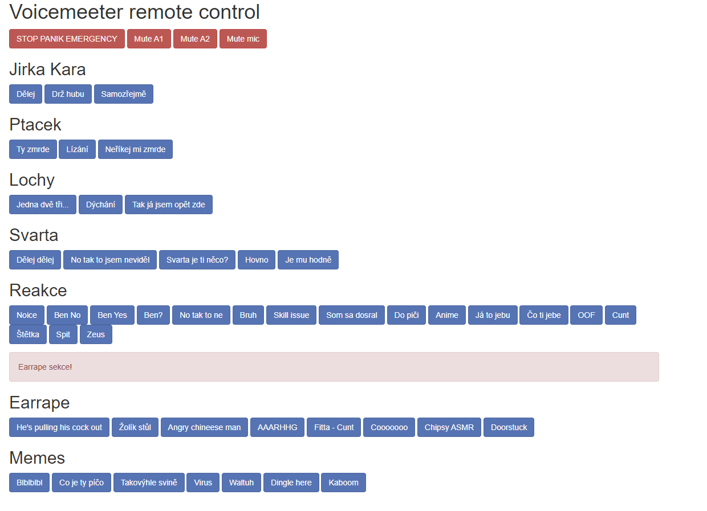

# Wemos-Voicemeeter

## Co to vlastně je?
Pomocí D1_mini můžeme spustit webserver, který bude naslouchat pro určitý POST request a následně ho odeslat pomocí AppleMIDI do PC.
## Jak to spustit?
Jsou dvě metody: 
- [binary soubor](#binary-soubor)
- [kompilace z .ino souboru](#kompilace-z-ino-souboru)
### Binary soubor
Stačí [stáhnout aktuální binary soubor](https://github.com/smaartscz/Wemos-Voicemeeter/releases) a flashnout ho na Wemos.
### Kompilace z .ino souboru
[Stáhneme si celý tento repozitář](https://github.com/smaartscz/Wemos-Voicemeeter/archive/refs/heads/master.zip).
Vyextrahujeme si ho a otevřeme Voicemeeter-midi-website.ino, zde provedeme potřebné úpravy a nahrajememe jako jakýkoliv jiný sketch na Wemos.
### First time setup
Pro více informací stačí zamířit na [Wiki](../../wiki)
# Knihovny
Program vyžaduje následující knihovny:
- [AppleMIDI](https://github.com/lathoub/Arduino-AppleMIDI-Library)
- [ESP8266mDNS](https://github.com/esp8266/Arduino/tree/master/libraries/ESP8266mDNS)
- [ESP8266WiFi](https://github.com/esp8266/Arduino/tree/master/libraries/ESP8266WiFi)
- [ArduinoOTA](https://github.com/jandrassy/ArduinoOTA)
- [WifiManager](https://github.com/tzapu/WiFiManager)
Naštěstí všechny knihovny lze nainstalovat přímo v Arduino IDE.

# Zdroje 
- [ArduinoSlovakia](https://www.arduinoslovakia.eu/blog/2019/4/esp8266---http-server-a-responzivny-dizajn?lang=en)
